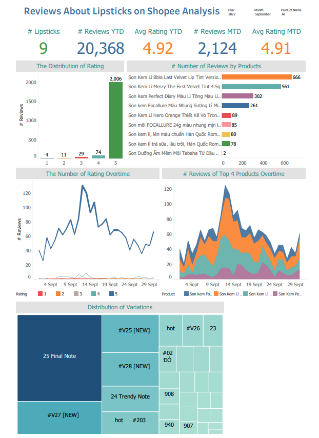
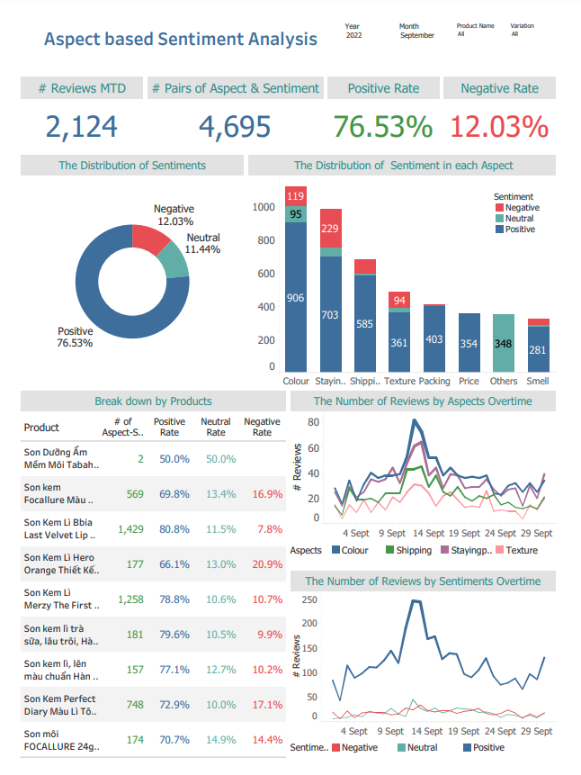

# An End-to-End Aspect-based Sentiment Analysis Platform for Vietnamese Reviews about Beauty Products on E-commerce Websites
This repo is for the paper **An End-to-End Aspect-based Sentiment Analysis Platform for Vietnamese Reviews about Beauty Products on E-commerce Websites**. The solution to build an end2end platform is described here with the code and software is updated on May 2023

## Description
Input: The text reviews in Vietnamese language on Ecommerce websites

Output: The dashboard for analytics on Aspect based Sentiment Analysis

List of aspect: [SMELL, COLOUR, PACKING, SHIPPING, STAYINGPOWER, TEXTURE, PRICE, OTHERS]

List of sentiment: [Positive, Neutral, Negative]

Example:

Input: Cây son có màu rất đẹp, còn rất lì nữa (The colour of the lipstick is beautiful, and it is very adhesive too)

Output: COLOUR:Positive, STAYINGPOWER:Positive

Dashboard examples:

## Reproducability
Check the Stag1 and Stage2 notebooks, change the model name on the dictionary to rerun the model

## Publication
In Reviews

## Contact
If you want to get the data or models, feel free to contact the authors at 18520997@gm.uit.edu.vn.